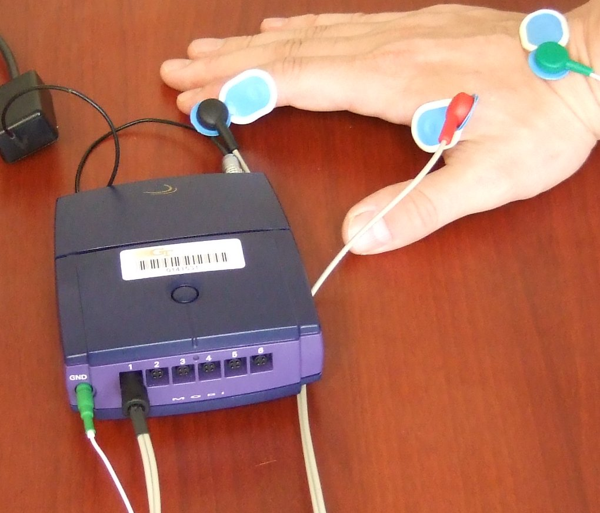
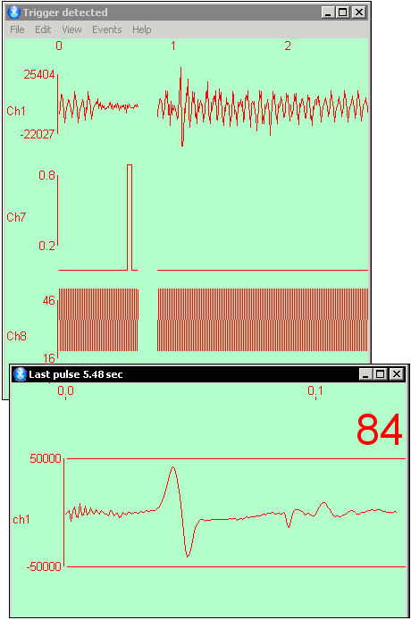

## EMG Recorder


Twente Medical Systems International (TMSi) produces a series of polygraphy devices that can measure the electrical signals from muscles (ECG, EMG) or the brain (EEG, ERP), for example, we use their [Mobi](https://www.tmsi.com/products/legacy-products/) to measure hand movements. Our free EMG Recorder software uses bluetooth to display and store this data in realtime. It should be noted that you can also use TMSi’s own [PortiLab(https://www.tmsi.com/?id=3) software to store data. In contrast, our software is simple to use and includes a couple features that are useful for us (using a digital input to start recording, saving to the BrainVision format, etc).


   
#####  Installation

The included source code can be compiled with Delphi for Windows. You will need to register the dll with your system. Launch a terminal window, change to the directory where you want to keep the files and type ‘regsvr32 PortiSerialSDK.dll’

 - [A pre-compiled version is also available](https://github.com/neurolabusc/EMG-Recorder/releases)

##### Acquiring data



 -  To run a study, simply launch the software – it should automatically detect your Blue Tooth hardware, and the maximum number of channels as well as maximum sample rate of your hardware will be displayed in the title bar. Choose View/Preferences to ensure that your desired settings will be used. Next choose Edit/Acquire to start recording data. Finally, choose File/SaveData to store a recording to disk. It is that easy.

The View/Preferences command allows you to adjust a few settings.

 - High pass filter: EMG signals tend to drift up and down over time. A high pass filter corrects for this, for EMG using a 10-20Hz high pass filter is typical. If set to zero, no filter is applied. This filter only influences the appearance of the data on the screen – the raw signal will be stored to disk.
 - Sample rate (Hz): sets how rapidly the electrodes are measured. Our TMSi systems have a maximum sample rate of 2048. EMGs have a surprising amount of high frequency information, so it is probably worth using the maximum value you system supports.
 - Max recording (sec): This software will start collecting data when you choose Edit/Acquire and continue until you choose File/Save or this the time you specify here elapses. For example, if you want to record data for up to 30 minutes, set this to 1800 seconds.
 - Trigger channel: often we want to observe traces prior to starting an experiment, for example to make sure the electrodes have a good signal. However, we only need to store data that is acquired after the experiment starts. Therefore, you can set value so the recording is reset when a trigger signal is recorded by the hardware. With our Mobi system, channel 7 records the optical trigger signal. If you set this to zero the software will store data from the moment you choose Edit/Acquire. If you forget to send a trigger signal, data will also be stored from the time of the Edit/Acquire command.
 - For each channel of your hardware, you will see two check boxes: A “Record” checkbox and a “Filter” checkbox. Only “Recorded” channels are displayed on screen and stored to disk. Only a channel that has both “Record” and “Filter” checked will be subjected to the High Pass Filter described earlier. With our Mobi system we do not filter Channel 7 (optical trigger) and Channel 8 (a saw pattern that ensures there were no bluetooth transmission errors). Note that a combination of high sample rates and recorded channels may exceed the bandwidth available. If you are not planning to analyze a channel, make sure the electrode lead is unplugged from the hardware, so that no data will be transmitted.

You will get an error message if the software can not detect the hardware at startup. The most common problem is that the hardware is not switched on, our the blue tooth hardware is not paired with your computer. First, quit the recording program and check the power light on your hardware. Second, check the BlueTooth configuration control panel on your hardware, finally you can change the “ComPort” number text file named “.ini” in the same folder as the recording software (this number should match what you see in your control panel, make sure the recording software is not running when you change this). Once you correct your problem, restart the recording software.

You can adjust many settings by editing the “.ini” text file that is in the same folder as the recording program. Make sure the program is not running when you edit this file. If you do not see this file, start and quit the recording software, and it should create a new file. Here are a few of the settings:

 - F1: This numbers specify the fundamental frequencies of the dummy trace that is created if you choose Edit/Acquire without any hardware. For example, if you choose F1=17 a data stream with 17Hz signals will be generated.
 - AudioChannel: Specifies which channel will be used to create an audio signal if View/Audio is selected. It is often useful to hear EMGs, as there is a different sound for a motor deficit due to brain injury versus peripheral injury.
 - Trace/Offline/Background specify the colors used for the graphs. These colors are 24-bits stored as Hex, such that 000000 is black, FFFFFF is white and AA0000 is a medium-bright red.

##### Events

 -  For our Transcranial Magnetic Current Stimulation (TMS) studies, we want to initially calibrate the intensity of the TMS pulse. The standard way of doing this is to place the TMS wand over the primary motor cortex and generate pulses that have a 50% chance of eliciting a motor evoked potential (MEP) with an intensity of at least 100 mV. The EMG recorder’s Events/ShowEvents allows you to see the size of the response generated by the most recent trigger. For our studies, we send a trigger signal with each TMS pulse. The recorder software indicates the peak-to-peak intensity of this response (in the figure above, the response 84 mV [84000 uV]) We use the [TMS Motor Threshold Assessment Tool](https://clinicalresearcher.org/software.htm) to calibrate our transcranial magnetic stimulation amplitude. The events menu allows you to adjust the scale, duration and time window for detecting peak-to-peak amplitudes.

##### Controlling the EMG Recorder with your own software

 -  You can use you own code to control this software. Specifically, you can start or end recording sessions and send event markers. This uses the ‘SendMessage’ Windows API function, which you can implement in most programming languages. Here is sample Pascal code

```
function SendDataDigit( I: integer; F: TForm): integer;
//I sends a command to the EEG recorder
//  I= -1 starts a new recording
//  I= -2 stops and saves a recording
//  I> 0 creates an event marker that will be saved as a BrainVision VMRK file
//   I= 1 saves a marker 'cond1'
//   I= 123 saves a marker 'cond123'
//  The temporal accuracy of events may be off by a couple msec
//    Send an optical pulse to precisely mark the onset time
//Returns positive integer value if successful
var
  receiverHandle  : THandle;
  copyDataStruct : TCopyDataStruct;
begin
  result :=-1;
  copyDataStruct.dwData := I; //use it to identify the message contents
  copyDataStruct.cbData := 0;
  copyDataStruct.lpData := nil;
  receiverHandle := FindWindow(PChar('TMobiRecordForm'),PChar('MobiRecordForm'));
  if receiverHandle = 0 then
    Exit;
  result := SendMessage(receiverHandle, WM_COPYDATA, Integer(F.Handle), Integer(@copyDataStruct));
end;
```

##### Links

 - My [ELEcro](https://github.com/neurolabusc/ELEcro) software can filter and average data collected with EMG Recorder. It reads and writes BrainVision Analyzer (.VHDR), EDF (.EDF) and TMS32 (.S00) file formats.

